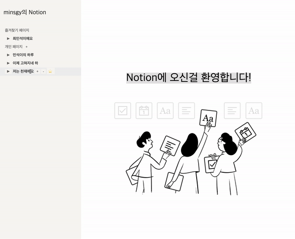
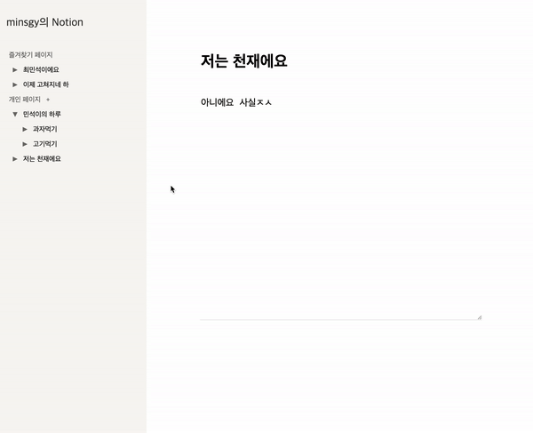
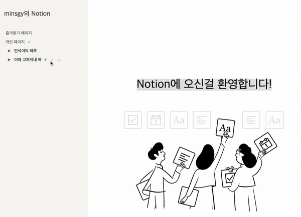

# 📕 에디터 프로젝트

VanilaJS를 활용하여 컴포넌트 방식의 에디터 작성하기 프로그램

- 자동 저장 및 편집, 하위 문서들을 관리 할 수 있는 '그' 프로그램과 비슷한 Editor 프로그램

## 프로젝트 기간

8월 28일 ~ 9월 3일, 7일

## 🛠 기술 스택

- HTML5
- CSS3
- JS(ES6)
- Storage(Local)

## 🖥 DEMO

- 즐겨찾기(Bookmark) 기능 / Toast 저장 완료 안내 기능

- 하위 컴포넌트 링크 렌더링 / 삭제 및 생성 Modal 구현

## 기본 기능 사항

- [x] 사이드 메뉴바를 통해서 문서를 선택/생성/제거
- [x] 문서마다의 하위 문서 생성 기능 존재
- [x] 즐겨찾기(Bookmark) 기능 (Localstorage)
- [x] 에디터 자동 저장 기능 및 TOAST Message
- [x] 문서 생성 시 Modal Page 제공
- [x] 하위 문서 렌더링 리스트 생성
